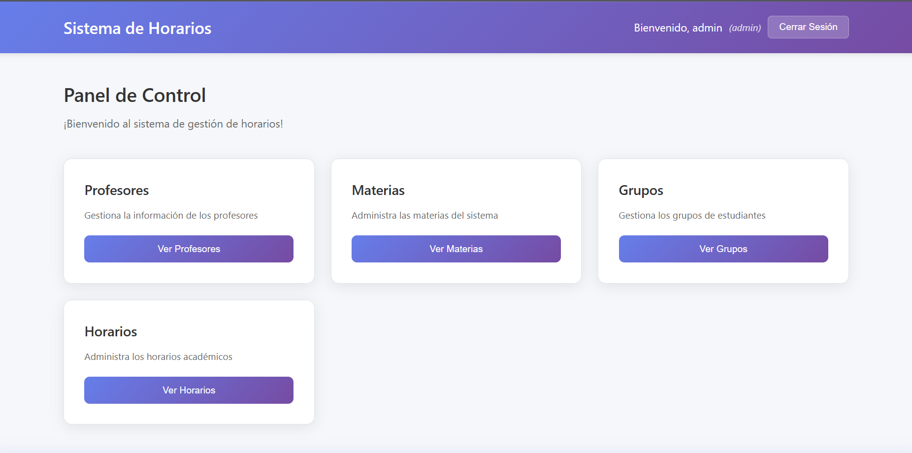
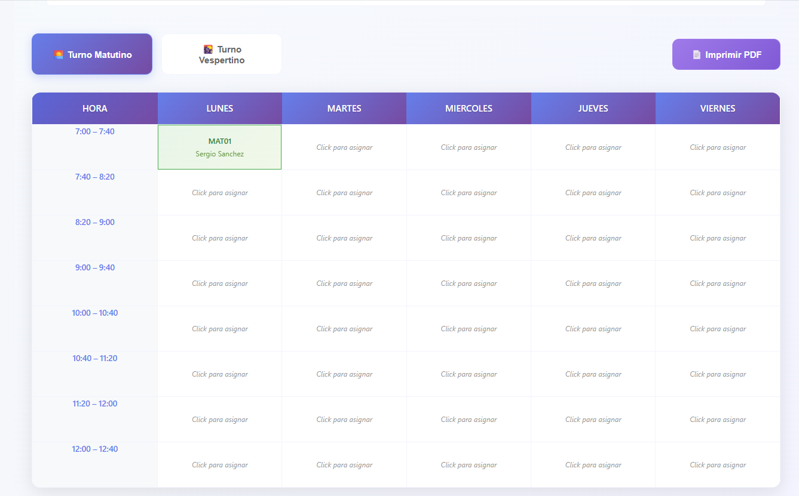
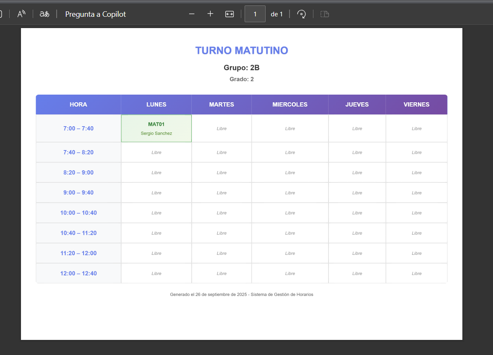

# 📚 Horarios App - Sistema de Gestión de Horarios Escolares

Una aplicación web completa para la gestión de horarios escolares desarrollada con el stack PERN (PostgreSQL, Express, React, Node.js).

## 🚀 Características

- ✅ **Gestión de Profesores** - CRUD completo para docentes
- ✅ **Gestión de Materias** - Administración de asignaturas
- ✅ **Gestión de Grupos** - Control de grupos/cursos
- ✅ **Gestión de Horarios** - Creación y edición visual de horarios
- ✅ **Exportación a PDF** - Impresión profesional de horarios
- ✅ **Sistema de Autenticación** - Login seguro con JWT
- ✅ **Interfaz Moderna** - UI responsive con tema morado elegante
- ✅ **Validación de Conflictos** - Prevención de choques de horarios

## 🛠️ Tecnologías

### Frontend
- **React 19.1.1** con TypeScript
- **Vite** como bundler
- **CSS3** con gradientes y diseño responsive
- **jsPDF** para exportación de PDFs

### Backend
- **Node.js** con Express
- **PostgreSQL** como base de datos
- **JWT** para autenticación
- **bcryptjs** para encriptación de contraseñas

## 📋 Requisitos Previos

- Node.js (v16 o superior)
- PostgreSQL (v12 o superior)
- npm o yarn

## 🏗️ Instalación

### 1. Clonar el repositorio
```bash
git clone https://github.com/sergiodev3/horarios-app.git
cd horarios-app
```

### 2. Configurar la base de datos
```bash
# Crear base de datos PostgreSQL
createdb horarios-db

# Ejecutar scripts de creación
psql -U postgres -d horarios-db -f backend/database/dbdesing.sql
```

### 3. Configurar el backend
```bash
cd backend
npm install

# Crear archivo .env
echo "JWT_SECRET=tu_jwt_secret_aqui" > .env
echo "DB_HOST=localhost" >> .env
echo "DB_PORT=5432" >> .env
echo "DB_NAME=horarios-db" >> .env
echo "DB_USER=postgres" >> .env
echo "DB_PASSWORD=tu_password" >> .env

# Crear usuario administrador
node createAdminUser.js
```

### 4. Configurar el frontend
```bash
cd ../frontend
npm install
```

## 🚀 Ejecución

### Desarrollo
```bash
# Terminal 1 - Backend
cd backend
npm run dev

# Terminal 2 - Frontend
cd frontend
npm run dev
```

La aplicación estará disponible en:
- Frontend: http://localhost:5173
- Backend API: http://localhost:4000

### Producción
```bash
# Build del frontend
cd frontend
npm run build

# Servidor en producción
cd ../backend
npm start
```

## 📁 Estructura del Proyecto

```
horarios-app/
├── backend/
│   ├── controllers/     # Controladores de API
│   ├── database/        # Scripts de BD y configuración
│   ├── middlewares/     # Middlewares de autenticación
│   ├── models/          # Modelos de datos
│   ├── routes/          # Rutas de API
│   └── server.js        # Servidor principal
├── frontend/
│   ├── src/
│   │   ├── components/  # Componentes React
│   │   ├── services/    # Servicios de API
│   │   └── types/       # Tipos TypeScript
│   └── public/          # Archivos estáticos
└── README.md
```

## 🔐 Usuario por Defecto

- **Usuario:** admin
- **Contraseña:** admin123

## 📱 Capturas de Pantalla

### Dashboard Principal


### Gestión de Horarios


### Exportación PDF


## 🛡️ Seguridad

- Autenticación JWT
- Contraseñas encriptadas con bcrypt
- Validación de entrada en frontend y backend
- Protección CORS configurada

## 🤝 Contribución

1. Fork el proyecto
2. Crea tu rama de feature (`git checkout -b feature/AmazingFeature`)
3. Commit tus cambios (`git commit -m 'Add some AmazingFeature'`)
4. Push a la rama (`git push origin feature/AmazingFeature`)
5. Abre un Pull Request

## 📄 Licencia

Este proyecto está bajo la Licencia MIT - ver el archivo [LICENSE](LICENSE) para detalles.

## 👨‍💻 Autor

**Sergio** - [sergiodev3](https://github.com/sergiodev3)

---

⭐ ¡Dale una estrella a este proyecto si te ha sido útil!